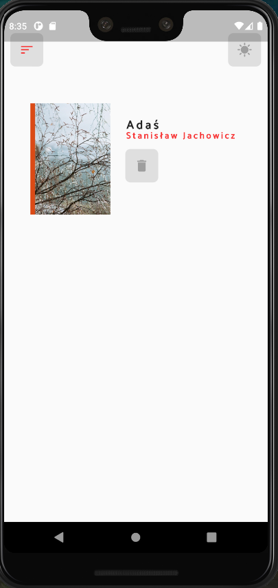

# Simple Book Store App

BookStore app with a feature-first layered clean architecture(BLOC), lazy loading, and adaptive theming. The UI of the app is intentionally kept simple, as my primary objective was to showcase the implementation of clean architecture, lazy loading, code logic, and clean architecture.

## Features

- Popular Book List: The app displays a list of popular Books.
- View Details: Access detailed information about each Book.
- add to card: Add and store favorite books locally using [Floor](https://pub.dev/packages/floor).
- Adaptive Theme: The app automatically adjusts its theme based on the device's settings and remembers user preferences.

## TECH STACK

- [Flutter](https://flutter.dev/)
- [Dart](https://dart.dev/)
- [wolnelektury.pl API](https://wolnelektury.pl/api/books/)

## Preview

<p>
    
    
    
    
    
</p>

## Folder Structure

- "core" folder contains application-agnostic code that can be reused in other projects.
- "feature" folder represents the app's feature set. Each feature is divided into subfolders for data, domain, and presentation.

## Packages

- State Management
  - [Bloc](https://pub.dev/packages/flutter_bloc)
- Caching
  - [Floor](https://pub.dev/packages/floor)
- Networking
  - [Dio](https://pub.dev/packages/dio)
- Routing
  - [AutoRoute](https://pub.dev/packages/auto_route)
- Dependency Injection
  - [GetIt](https://pub.dev/packages/get_it)
- JsonParsing
  - [JsonSerializable](https://pub.dev/packages/json_serializable)

### Run this project

##### Clone this repository

```sh
git clone https://github.com/iwaai/BookStore-Clean-Architecture-
```

##### Go to the project directory

```sh
cd BOOKSTORE
```

##### Get all the packages

```sh
flutter pub get
```

##### Execute this command in the terminal

```sh
dart run build_runner build --delete-conflicting-outputs

```

##### Run the project
